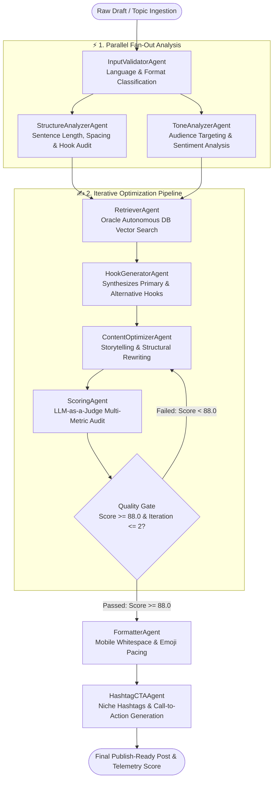

<div align="center">

# 💼 LinkedIn Post Optimizer — Agentic AI Studio
### Stateful Multi-Agent System with Oracle Autonomous Vector Search & Feedback Loops

[](https://python.org)
[](https://langchain-ai.github.io/langgraph/)
[](https://www.oracle.com/autonomous-database/)
[](https://fastapi.tiangolo.com/)
[](https://streamlit.io/)
[](https://docs.pydantic.dev/)

<p align="center">
  <a href="#-executive-summary">Executive Summary</a> •
  <a href="#-agentic-graph-topology">Graph Topology</a> •
  <a href="#-the-9-agent-collaborative-pipeline">Agent Pipeline</a> •
  <a href="#-oracle-autonomous-database-vector-rag">Oracle Cloud Vector RAG</a> •
  <a href="#-llm-as-a-judge-scoring-loop">Quality Gate Loop</a>
</p>

</div>

---

## 📌 Executive Summary

Professional personal branding and B2B corporate influencer strategies on LinkedIn depend heavily on content pacing, high-retention hooks, readable whitespace formatting, and emotional resonance. Generic AI writing tools frequently output identifiable, generic text walls lacking authentic storytelling, algorithmic structure, and punchy hooks.

**LinkedIn Post Optimizer** is an autonomous, stateful multi-agent pipeline engineered with **LangGraph, FastAPI, and Streamlit**. It takes raw draft ideas or unstructured thoughts, parses them across parallel linguistic and structural analyzer nodes, grounds them against verified high-performing reference posts stored in **Oracle Cloud Autonomous Database AI Vector Search**, and refines the draft through an autonomous **LLM-as-a-Judge feedback loop**.

The platform is accessible via an asynchronous **FastAPI REST endpoint** and an interactive, dark-mode **Streamlit Studio** featuring real-time node execution streaming and an interactive mobile feed simulator.

---

## 🏛️ Agentic Graph Topology

The architecture leverages a directed cyclical graph featuring **Parallel Fan-Out/Fan-In analysis**, vector retrieval grounding, and an iterative self-correction loop capped at two retries:


---

## 🧠 The 9-Agent Collaborative Pipeline

| Agent Node | Class | Computational Role & Analytical Output |
| :--- | :--- | :--- |
| **Input Validator** | `InputValidatorAgent` | Distinguishes between half-baked bullet points (`topic`) vs. drafted texts (`draft`), detects language (ISO 639-1). |
| **Structure Analyzer** | `StructureAnalyzerAgent` | Analyzes paragraph counts, sentence lengths, and flags visual readability flaws (e.g., text walls). |
| **Tone Analyzer** | `ToneAnalyzerAgent` | Classifies authorial persona, sentiment, and estimates target audience resonance. |
| **RAG Retriever** | `RetrieverAgent` | Vectorizes input query and queries top-$k$ reference posts from Oracle Autonomous DB via cosine distance. |
| **Hook Generator** | `HookGeneratorAgent` | Generates 3–5 high-conversion headline variants based on curiosity gaps, contrasting perspectives, or bold claims. |
| **Content Optimizer** | `ContentOptimizerAgent` | Synthesizes the core body text, incorporating hook selections and addressing structural critique. |
| **Quality Judge** | `ScoringAgent` | Evaluates the draft on a 0–100 scale across Readability, Hook appeal, Structure, and Call-to-Action clarity. |
| **Post Formatter** | `FormatterAgent` | Enforces mobile-friendly formatting: 1–2 sentence paragraphs, conversational line breaks, and strategic emojis. |
| **Hashtag & CTA** | `HashtagCTAAgent` | Appends a high-engagement open question (CTA) and generates 3–5 targeted niche hashtags. |

---

## 🗄️ Oracle Autonomous Database Vector RAG

Unlike standard sandbox vector engines, the retrieval layer interfaces directly with **Oracle Cloud Autonomous Database Serverless (`landmansitdb_high`)** via mTLS Oracle Wallet credentials:

### 1. Cloud-Native SQL Vector Operations
* The reference corpus is vectorized using OpenAI’s `text-embedding-3-small` model and stored directly in a native `VECTOR` column within the `linkedin_knowledge` table.
* Dense similarity queries execute in-database using Oracle 23ai native vector syntax:
  ```sql
  SELECT id, category, hook, full_text, why_high_performing,
         VECTOR_DISTANCE(embedding, TO_VECTOR(:1), COSINE) AS distance
  FROM linkedin_knowledge
  ORDER BY distance ASC
  FETCH FIRST :top_k ROWS ONLY;
  ```

### 2. Curated Golden Dataset
The knowledge store is grounded in a curated benchmark dataset (`golden_dataset_linkedin.json`) categorizing verified high-performing posts across:
* **Personal Storytelling:** Vulnerability hooks with career inflection points.
* **Value Listicles:** Actionable frameworks and curated tool lists.
* **Controversial Theses:** Contrarian perspectives triggering debate.
* **B2B Case Studies:** Concrete metrics, before/after transformations, and lessons learned.

---

## 🔁 LLM-as-a-Judge Scoring & Self-Correction Loop

To guarantee publication-grade quality, the pipeline implements an automated **Reflect-and-Refine Loop** (`feedback_loop_router`):

1. **Multi-Metric Evaluation:** The `ScoringAgent` grades drafts across four distinct dimensions:
   * **Readability Score:** Visual cadence and lexical flow.
   * **Hook Strength Score:** Curiosity trigger and scroll-stopping power.
   * **Structure Score:** Mobile-first whitespace and paragraph length.
   * **CTA Score:** Presence of open-ended conversational invitations.
2. **Deterministic Threshold Enforcement:** If the weighted `overall_score` is $< 88.0$, the graph routes execution back to the `ContentOptimizerAgent`, passing structured feedback notes into the state.
3. **Loop Circuit Breaker:** Capped strictly at `iteration_count = 2` to guarantee predictable token expenditure and latency limits.


---


## 🛠️ Enterprise Tech Stack Matrix

| Domain | Technology | Engineering Role & Specifications |
| :--- | :--- | :--- |
| **Agent Orchestration** | **LangGraph** | Stateful cyclical graph with parallel Fan-Out/Fan-In and reflection routing |
| **Data Contracts** | **Pydantic v2** | Strict validation of inter-agent schemas (`PostOptimizerState`, `ScoreReport`) |
| **Vector Engine & Cloud**| **Oracle Autonomous DB (23ai)** | Serverless cloud instance with native `VECTOR` column and mTLS Wallet encryption |
| **Database Connectivity**| **python-oracledb** | Secure Thin-Mode connection over high-priority service strings (`landmansitdb_high`) |
| **Embeddings & Inference**| **OpenAI & Ollama** | Hybrid factory: Cloud `gpt-4o-mini` / `text-embedding-3-small` or Local `qwen2.5-coder:14b` |
| **Interactive Studio UI**| **Streamlit & Custom CSS** | Bespoke dark-theme UI with live streaming node tracing and simulated mobile viewport |
| **API Transport Gateway**| **FastAPI** | Asynchronous REST gateway (`/api/optimize`) with CORS middleware |
| **Testing Harness** | **Pytest & pytest-asyncio** | Automated unit and integration testing covering all 9 agent nodes and routing edges |

---

## 📂 Repository Topology

```text
linkedin-optimizer/
├── config/                               # Central System Configuration
│   ├── __init__.py
│   └── settings.py                       # Pydantic BaseSettings (.env loading & provider enums)
│
├── src/                                  # Core Agentic Package
│   ├── agents/                           # 9 Specialized LangGraph Worker Nodes
│   │   ├── base.py                       # Abstract BaseAgent with telemetry & BYOK resolution
│   │   ├── input_validator.py            # Draft vs. topic intent classification & language detection
│   │   ├── structure_analyzer.py         # Whitespace, line-break & paragraph pacing analysis
│   │   ├── tone_analyzer.py              # Audience persona & sentiment classification
│   │   ├── retriever.py                  # Oracle Autonomous DB vector search integration
│   │   ├── hook_generator.py             # Curiosity-driven headline synthesis (Primary + Alternatives)
│   │   ├── content_optimizer.py          # Core body text editor with iterative feedback injection
│   │   ├── scoring.py                    # LLM-as-a-judge multi-metric scoring engine
│   │   ├── formatter.py                  # Mobile-first line-break formatting & emoji curation
│   │   └── hashtag_cta.py                # Actionable CTA synthesis & niche hashtag generation
│   │
│   ├── core/                             # Foundational Services
│   │   ├── llm_factory.py                # Dynamic provider factory (OpenAI ↔ Ollama) with BYOK support
│   │   └── rag_manager.py                # Oracle Cloud vector retrieval client with in-memory fallbacks
│   │
│   ├── graph/                            # Graph Architecture
│   │   └── builder.py                    # StateGraph construction, Fan-Out edges & reflection loops
│   │
│   ├── state/                            # Domain Data Models
│   │   └── models.py                     # Pydantic v2 PostOptimizerState, ScoreReport, and Analysis DTOs
│   │
│   └── api/                              # REST Interface
│       └── server.py                     # FastAPI application exposing /api/optimize and /health
│
├── tests/                                # Automated Test Harness
│   ├── test_agents.py                    # Agent execution tests
│   ├── test_graph.py                     # Graph compilation and topological edge tests
│   ├── test_llm_factory.py               # Provider resolution & BYOK validation tests
│   ├── test_phase2_analyzers.py          # Parallel analyzer unit tests
│   ├── test_phase3_rag.py                # Oracle vector retrieval tests
│   ├── test_phase4_optimization.py       # Hook and content generation tests
│   └── test_phase5_scoring.py            # Quality scoring & feedback router threshold tests
│
├── wallet/                               # Oracle Cloud Autonomous DB mTLS Credentials (Protected)
├── app.py                                # Streamlit Studio with live streaming node execution
├── main.py                               # CLI execution runner
├── load_knowledge_to_oracle.py           # Vectorization & ingestion script for Golden Dataset
├── golden_dataset_linkedin.json          # Curated benchmark dataset across 4 post archetypes
└── pyproject.toml                        # Project metadata & dependency definitions
```

---

## ⚡ Quickstart & Execution

### Prerequisites
* **Python 3.11+**
* **OpenAI API Key** *(or local Ollama instance)*
* *(Optional)* Oracle Autonomous Database Wallet credentials (in `./wallet`)

---

### 1. Installation

```bash
# Clone repository
git clone https://github.com/your-username/linkedin-post-optimizer-ai.git
cd linkedin-post-optimizer-ai

# Initialize virtual environment
python -m venv venv
source venv/bin/activate  # On Windows: venv\Scripts\activate

# Install dependencies
pip install -r requirements.txt
```

---

### 2. Configure Environment Variables

Create a `.env` file in the project root:

```env
# Primary LLM Configuration
OPENAI_API_KEY="sk-proj-..."
DEFAULT_LLM_PROVIDER="openai"
DEFAULT_MODEL_NAME="gpt-4o-mini"

# Local Ollama Fallback (Optional)
OLLAMA_BASE_URL="http://localhost:11434"
OLLAMA_DEFAULT_MODEL="qwen2.5-coder:14b"

# Oracle Autonomous Database (mTLS Wallet)
ORACLE_USER="ADMIN"
ORACLE_PASSWORD="your-db-password"
ORACLE_DSN="landmansitdb_high"
ORACLE_WALLET_DIR="./wallet"
ORACLE_WALLET_PASSWORD="your-wallet-password"
```

---

### 3. Ingest the Golden Dataset into Oracle Cloud (Optional)

Embed and store the curated benchmark dataset in Oracle Cloud Vector Search:

```bash
python load_knowledge_to_oracle.py
```
> Automatically provisions the `linkedin_knowledge` table, converts posts to 1536-dimensional vectors, and commits records using Oracle `MERGE` SQL statements.

---

### 4. Launch Interfaces

#### Interface 1: Interactive Streamlit Studio
Features live streaming agent status, a simulated LinkedIn mobile feed, and radial SVG metric gauges:
```bash
streamlit run app.py
```
> Access the workspace at `http://localhost:8501`.

#### Interface 2: CLI Pipeline Runner
Execute an automated test pass from the terminal:
```bash
python main.py
# Or run complete end-to-end integration validation:
python test_full_pipeline.py
```

#### Interface 3: FastAPI REST Service
Deploy the backend API for integration into external web clients or CMS pipelines:
```bash
uvicorn src.api.server:app --host 0.0.0.0 --port 8000 --reload
```

---

## 📱 Interactive Streamlit Studio Features

The web studio (`app.py`) is designed as a focused, dark-mode LinkedIn creator cockpit:

* **Live Agent Streaming (`_run_stream`):** Uses LangGraph's asynchronous streaming (`graph.astream()`) to visually indicate which agent node is currently active (e.g., `🔍 Content Analyzer`, `🪝 Hook Optimizer`, `📊 Scoring`).
* **Interactive Mobile Viewport:** Renders the optimized post inside a realistic iPhone feed frame, accurately simulating line breaks, avatar badges, and engagement counters.
* **SVG Radial Gauges:** Custom mathematical SVG arc gauges dynamically visualizing sub-scores across *Readability*, *Hook Strength*, *CTA Impact*, and *Overall Score*.
* **BYOK (Bring Your Own Key) Session Privacy:** Supports ephemeral user API key entry in the sidebar without persisting tokens to disk or database.

---

## 📡 REST API Specification

### `POST /api/optimize`
Processes raw drafts or unstructured bullet points through the multi-agent graph.

#### Request Body
```json
{
  "raw_input": "80% of multi-agent systems fail due to bad state management. 3 lessons: use Pydantic v2, decouple via Fan-Outs, bound feedback loops.",
  "language": "en"
}
```

#### Response Structure
```json
{
  "status": "success",
  "state": {
    "selected_hook": "80% of multi-agent AI systems never make it to production. Here is why:",
    "optimized_content": "80% of multi-agent AI systems never make it to production. Here is why:\n\nLast year, our team learned the hard way that prompt engineering doesn't scale without rigid state boundaries.\n\nHere are 3 architectural rules we now enforce:\n\n1. Use Pydantic v2 for strict state contracts\n2. Decouple parallel workflows via Fan-Outs\n3. Hard-cap your reflection loops to prevent runaway token costs\n\nWhat is your biggest bottleneck when building with LangGraph?\n\n#AgenticAI #LangGraph #SoftwareArchitecture",
    "score": {
      "overall_score": 92.5,
      "readability_score": 94.0,
      "hook_strength_score": 91.0,
      "structure_score": 93.0,
      "cta_score": 92.0,
      "feedback_notes": ["Strong hook contrast", "Clear whitespace spacing"]
    },
    "iteration_count": 1
  }
}
```

---

## 🧪 Testing & Verification

The suite covers unit logic, provider fallbacks, and cyclic graph compilation:

```bash
# Execute entire test suite
pytest tests/ -v

# Run targeted feedback loop routing tests
pytest tests/test_phase5_scoring.py -v
```

---

## 👨‍💻 Engineering & Systems Architecture

Architected by **Elvijs Landmans** ([landmansIT](https://landmansit.de)).

* **Domain Convergence:** Merging algorithmic social dynamics (viral content structuring) with strict enterprise multi-agent workflows.
* **Cloud-Native Enterprise Databases:** Leveraging **Oracle Autonomous Database** AI Vector Search over commercial toy vector databases.
* **Autonomous Self-Improvement:** Utilizing **LLM-as-a-Judge** scoring nodes as active conditional routing gates to guarantee publication quality.

---

## 📄 License

Proprietary Software. All Rights Reserved. Developed for enterprise thought leadership and content optimization pipelines.
